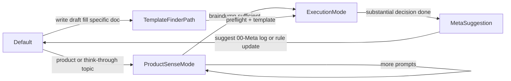

# PM Brain – Architecture Overview

**What this file is:** Short visual reference for repo structure and methods flow. For full navigation: [README.md](README.md), [AGENTS.md](AGENTS.md). For product thinking: [0-start-here-product-thinking.md](02-Methods-and-Tools/2.0-Foundations/2.0.1-Mental-Models/6-Product-Sense-Development/0-start-here-product-thinking.md). For “I need a template”: [0-template-finder.md](02-Methods-and-Tools/0-template-finder.md). For “everything about topic X”: [1-frameworks-by-topic.md](02-Methods-and-Tools/1-frameworks-by-topic.md).

---

## Repo layers

**In plain English:** The repo has five main folders at the top level. Each holds a different kind of content. The box view below works in any preview; the list and table follow.

**Visual (boxes):**

```
┌─────────────────┐ ┌─────────────────────┐ ┌──────────────────────┐ ┌─────────────────────┐ ┌──────────────┐
│ 00-Meta         │ │ 01-Company-Context   │ │ 02-Methods-and-Tools  │ │ 03-Research-Artifacts│ │ 04-Initiatives│
│ practice, learn │ │ vision, strategy    │ │ frameworks (2.0–2.4)  │ │ research storage     │ │ active work   │
└─────────────────┘ └─────────────────────┘ └──────────────────────┘ └─────────────────────┘ └──────────────┘
```

**The five folders:**

- **00-Meta** — practice, learning log, growth portfolio, Product Judgment Test  
- **01-Company-Context** — vision, strategy, stakeholders  
- **02-Methods-and-Tools** — frameworks, guides, templates (2.0–2.4)  
- **03-Research-Artifacts** — research storage  
- **04-Initiatives** — active work, one folder per bet  

| Area | Purpose |
|------|---------|
| **00-Meta** | What you *do* and *learn* — daily log, learning log, growth portfolio, Product Judgment Test. Canonical prompts/templates live in 6-Product-Sense-Development. |
| **01-Company-Context** | Your company’s direction and constraints. Customize; keep current. |
| **02-Methods-and-Tools** | Reusable frameworks (2.0–2.4). Flow below. |
| **03-Research-Artifacts** | Research storage. Link to initiatives. |
| **04-Initiatives** | One folder per bet; day-to-day product work. |

---

## Methods flow (02-Methods-and-Tools)

**In plain English:** Inside `02-Methods-and-Tools/` you work in this order: **think** (Foundations) → **set direction** (Strategy) → **discover** (Discovery) → **build and ship** (Execution), while **communicating** all along (Communication). The box flow below works in any preview; the table follows.

**Visual (flow, left to right):**

```
┌──────────────┐     ┌──────────────┐     ┌──────────────┐     ┌──────────────┐     ┌──────────────────┐
│ 2.0 Found.   │ ──► │ 2.1 Strategy │ ──► │ 2.2 Discovery│ ──► │ 2.3 Execution│ ──► │ 2.4 Communication│
│ think first  │     │ set direction│     │ discover     │     │ build & ship │     │ communicate      │
└──────────────┘     └──────────────┘     └──────────────┘     └──────────────┘     └──────────────────┘
```

**Flow (text):** `2.0 Foundations` → `2.1 Strategy` → `2.2 Discovery` → `2.3 Execution` → `2.4 Communication`

| Layer | Contents |
|-------|----------|
| **2.0 Foundations** | Think first — product sense entry, mental models, bias. Start here before templates. |
| **2.1 Strategy** | Direction, goals, roadmap, prioritization. |
| **2.2 Discovery** | Research, JTBD, opportunity assessment, idea validation. |
| **2.3 Execution** | PRDs, personas, metrics, execution rituals. |
| **2.4 Communication** | Stakeholder comms, one-pagers, crisis, escalation, saying no. |

---

## Agent mode flow (state diagram)

**In plain English:** The assistant switches between modes depending on whether you're thinking things through, asking for a specific doc, or wrapping up with reflection.



- **ProductSenseMode**: Entered when the topic is product/stakeholder/org/strategy/roadmap/prioritization/discovery/execution or \"help me think through something\". Stay here while you braindump using prompts from `2-product-sense-prompts.md` and the golden rule in `PRODUCT-SENSE-RULES.md`, until the \"braindump sufficient\" checklist is met.
- **TemplateFinderPath**: Entered when you explicitly ask to write/draft/fill a specific doc (PRD, OKR, one-pager, etc.). Use `02-Methods-and-Tools/0-template-finder.md` to jump straight to the right README + template, optionally asking 1–2 preflight prompts for non-trivial docs.
- **ExecutionMode**: After sufficient braindump (or via TemplateFinderPath), help structure thinking and apply the right framework/template from `02-Methods-and-Tools/`.
- **MetaSuggestion**: After substantial decision work, suggest logging in `00-Meta/` (forecast log, learning log, pattern recognition) and optionally updating rules (see `.cursor/rules/thinking.mdc`), then return to Default for the next conversation.

---

## Linking Conventions

**Cross-domain references:** Point to domain `README.md` files (e.g., `2.0-Foundations/README.md`, `2.1-Strategy/README.md`). These serve as stable entry points for each domain.

**Within-domain references:** 
- Use sibling links for closely related files (e.g., `1-framework.md`, `2-template.md`)
- Use `../README.md` to reference the domain index
- Use stable paths for nearby subdomains (e.g., `../2.0.2-Bias/README.md`)

**Deep links:** Only use deep links (e.g., `../../2.0-Foundations/2.0.3-Self-Reflection/README.md`) when specifically referencing a particular framework in context, or in "Related frameworks" sections. Prefer domain indices for general navigation.

**When adding new frameworks:** Follow these conventions to maintain consistent navigation patterns.
