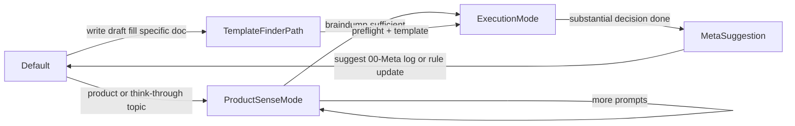
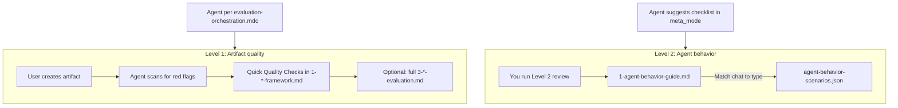
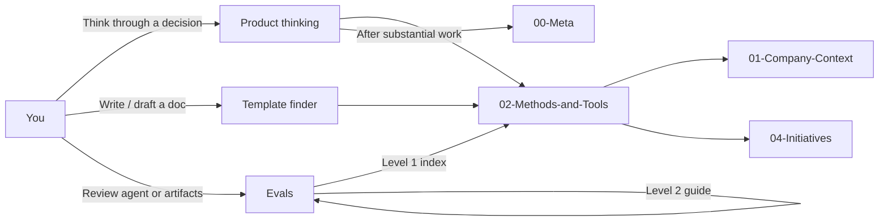

# PM Brain – Architecture Overview

**What this file is:** Short visual reference for repo structure and methods flow. For full navigation: [README.md](README.md), [AGENTS.md](AGENTS.md). For product thinking: [0-start-here-product-thinking.md](02-Methods-and-Tools/2.0-Foundations/2.0.1-Mental-Models/6-Product-Sense-Development/0-start-here-product-thinking.md). For “I need a template”: [0-template-finder.md](02-Methods-and-Tools/0-template-finder.md). For “everything about topic X”: [1-frameworks-by-topic.md](02-Methods-and-Tools/1-frameworks-by-topic.md). For evals (methods + agent behavior): [.cursor/evals/README.md](.cursor/evals/README.md).

---

## Repo layers

The repo has five main folders at the top level. Each holds a different kind of content. The box view below works in any preview; the list and table follow.

**Visual (boxes):**

```
┌─────────────────┐ ┌─────────────────────┐ ┌──────────────────────┐ ┌─────────────────────┐ ┌──────────────┐
│ 00-Meta         │ │ 01-Company-Context   │ │ 02-Methods-and-Tools  │ │ 03-Research-Artifacts│ │ 04-Initiatives│
│ practice, learn │ │ vision, strategy    │ │ frameworks (2.0–2.4)  │ │ research storage     │ │ active work   │
└─────────────────┘ └─────────────────────┘ └──────────────────────┘ └─────────────────────┘ └──────────────┘
```

**The five folders:**

- **00-Meta** — practice, learning log, growth portfolio, Product Judgment Test  
- **01-Company-Context** — vision, strategy, stakeholders  
- **02-Methods-and-Tools** — frameworks, guides, templates (2.0–2.4)  
- **03-Research-Artifacts** — research storage  
- **04-Initiatives** — active work, one folder per bet  

| Area | Purpose |
|------|---------|
| **00-Meta** | What you *do* and *learn* — daily log, learning log, growth portfolio, Product Judgment Test. Canonical prompts/templates live in 6-Product-Sense-Development. |
| **01-Company-Context** | Your company’s direction and constraints. Customize; keep current. |
| **02-Methods-and-Tools** | Reusable frameworks (2.0–2.4). Flow below. |
| **03-Research-Artifacts** | Research storage. Link to initiatives. |
| **04-Initiatives** | One folder per bet; day-to-day product work. |

---

## Methods flow (02-Methods-and-Tools)

Inside `02-Methods-and-Tools/` you work in this order: **think** (Foundations) → **set direction** (Strategy) → **discover** (Discovery) → **build and ship** (Execution), while **communicating** all along (Communication). The box flow below works in any preview; the table follows.

**Visual (flow, left to right):**

```
┌──────────────┐     ┌──────────────┐     ┌──────────────┐     ┌──────────────┐     ┌──────────────────┐
│ 2.0 Found.   │ ──► │ 2.1 Strategy │ ──► │ 2.2 Discovery│ ──► │ 2.3 Execution│ ──► │ 2.4 Communication│
│ think first  │     │ set direction│     │ discover     │     │ build & ship │     │ communicate      │
└──────────────┘     └──────────────┘     └──────────────┘     └──────────────┘     └──────────────────┘
```

**Flow (text):** `2.0 Foundations` → `2.1 Strategy` → `2.2 Discovery` → `2.3 Execution` → `2.4 Communication`

| Layer | Contents |
|-------|----------|
| **2.0 Foundations** | Think first — product sense entry, mental models, bias. Start here before templates. |
| **2.1 Strategy** | Direction, goals, roadmap, prioritization. |
| **2.2 Discovery** | Research, JTBD, opportunity assessment, idea validation. |
| **2.3 Execution** | PRDs, personas, metrics, execution rituals. |
| **2.4 Communication** | Stakeholder comms, one-pagers, crisis, escalation, saying no. |

---

## Agent mode flow (state diagram)

The assistant switches between modes depending on whether you're thinking things through, asking for a specific doc, or wrapping up with reflection.



- **ProductSenseMode**: Entered when the topic is product/stakeholder/org/strategy/roadmap/prioritization/discovery/execution or \"help me think through something\". Stay here while you braindump using prompts from `2-product-sense-prompts.md` and the golden rule in `PRODUCT-SENSE-RULES.md`, until the \"braindump sufficient\" checklist is met.
- **TemplateFinderPath**: Entered when you ask to write/draft/fill a specific doc (PRD, OKR, one-pager, etc.). Use `02-Methods-and-Tools/0-template-finder.md` to jump straight to the right README + template, optionally asking 1–2 preflight prompts for non-trivial docs.
- **ExecutionMode**: After sufficient braindump (or via TemplateFinderPath), help structure thinking and apply the right framework/template from `02-Methods-and-Tools/`.
- **MetaSuggestion**: After substantial decision work, suggest logging in `00-Meta/` (forecast log, learning log, pattern recognition), optionally running the Level 2 checklist ([.cursor/evals/1-agent-behavior-guide.md](.cursor/evals/1-agent-behavior-guide.md)), and optionally updating rules (see `.cursor/rules/thinking.mdc`), then return to Default for the next conversation.

**Evals** are a separate workflow (see Evaluation system below), not a conversation state. The agent may suggest the Level 2 checklist in MetaSuggestion; you run evals when you choose.

---

## Evaluation system (evals)

Evals are **guidance-based** (no scripts). Two levels: (1) **Level 1** = artifact quality (methods/frameworks) — lives in `02-Methods-and-Tools/` (Quick Quality Checks in `1-*-framework.md`, full review in `3-*-evaluation.md`); (2) **Level 2** = agent behavior — lives in `.cursor/evals/` ([1-agent-behavior-guide.md](.cursor/evals/1-agent-behavior-guide.md), [2-checklist.md](.cursor/evals/2-checklist.md), [agent-behavior-scenarios.json](.cursor/evals/agent-behavior-scenarios.json)). You run evals when it matters; when you learn something new, you update the right file (see "Where to update" in the evals guide).

**How evals are used (visual):**



- **Level 1 during creation:** The agent uses Quick Quality Checks automatically per `.cursor/rules/evaluation-orchestration.mdc` when you work on frameworks with evaluation support (PRD, Opportunity Assessment, North Star, One-Pager, OKR, Roadmap).
- **Level 2:** You (or an AI with the pasteable prompt) run the checklist when you choose; the agent may suggest it after substantial conversations (see [AGENTS.md](AGENTS.md) → meta_mode). Scenarios in JSON are reference only—you match your conversation to a scenario type and use success_indicators / failure_modes to score; the agent does not read the JSON.
- **Entry point:** [.cursor/evals/README.md](.cursor/evals/README.md) — intro, separation of evals, how it learns / ask user to adapt, pasteable prompts, file map.
- **Behavior logging and pattern detection:** For optional instrumentation hooks and log format, see [eval-functions.md](.cursor/evals/eval-functions.md) and [eval-results/README.md](.cursor/evals/eval-results/README.md). These enable tracking agent behavior over time for pattern detection (non-blocking).

---

## How the repo is used (entry points and flows)

The repo has a few main entry points. Depending on what you're doing, the agent (or you) routes to the right place. The diagram below shows how those entry points connect to the rest of the repo.

**Where to start (quick reference):**

| I want to... | Go to |
|--------------|-------|
| **Think through a product decision** | [0-start-here-product-thinking.md](02-Methods-and-Tools/2.0-Foundations/2.0.1-Mental-Models/6-Product-Sense-Development/0-start-here-product-thinking.md) — braindump first, then frameworks |
| **I know the doc I need** (PRD, OKR, roadmap, etc.) | [0-template-finder.md](02-Methods-and-Tools/0-template-finder.md) — jump straight to template |
| **Understand the system architecture** | [ARCHITECTURE.md](ARCHITECTURE.md) — visual overview, flows, context management |
| **Configure the agent** | [AGENTS.md](AGENTS.md) — agent behavior, modes, eval checkpoints |
| **Run evals** (artifact quality or agent behavior) | [.cursor/evals/README.md](.cursor/evals/README.md) — Level 1 (methods) or Level 2 (agent behavior) |
| **Set up for the first time** | [SETUP.md](SETUP.md) — company context, agent config, optional 00-Meta setup |



| Entry point | Trigger | Where it leads |
|-------------|---------|----------------|
| **Product thinking** | You're braindumping, exploring, or asking for help with a decision | [0-start-here-product-thinking.md](02-Methods-and-Tools/2.0-Foundations/2.0.1-Mental-Models/6-Product-Sense-Development/0-start-here-product-thinking.md) → product_sense_mode → then [02-Methods-and-Tools/](02-Methods-and-Tools/README.md) (framework/template). After substantial work, agent may suggest [00-Meta/](00-Meta/README.md) (log, forecast, learning). |
| **Template finder** | You ask to write/draft/fill a specific doc (PRD, OKR, one-pager, etc.) | [0-template-finder.md](02-Methods-and-Tools/0-template-finder.md) → right README + template in 02-Methods-and-Tools. For frameworks with evaluation support, agent uses Quick Quality Checks ([evaluation-orchestration.mdc](.cursor/rules/evaluation-orchestration.mdc)). |
| **Evals** | You want to review artifact quality or agent behavior | [.cursor/evals/README.md](.cursor/evals/README.md) → Level 1 (Methods) or Level 2 (agent-behavior guide, checklist, scenarios as reference). Agent may suggest Level 2 checklist after substantial conversations (meta_mode). |

---

## Linking Conventions

**Cross-domain references:** Point to domain `README.md` files (e.g., `2.0-Foundations/README.md`, `2.1-Strategy/README.md`). These serve as stable entry points for each domain.

**Within-domain references:** 
- Use sibling links for closely related files (e.g., `1-framework.md`, `2-template.md`)
- Use `../README.md` to reference the domain index
- Use stable paths for nearby subdomains (e.g., `../2.0.2-Bias/README.md`)

**Deep links:** Only use deep links (e.g., `../../2.0-Foundations/2.0.3-Self-Reflection/README.md`) when specifically referencing a particular framework in context, or in "Related frameworks" sections. Prefer domain indices for general navigation.

**Agent guidance placement:** "For Agents" sections (agent-facing instructions on when/how to suggest frameworks) follow this convention:
- **If a framework folder has `1-*-framework.md`:** Place "For Agents" section in `1-*-framework.md` (after the overview). The folder `README.md` serves as human-facing index/navigation only.
- **If a framework folder does NOT have `1-*-framework.md`:** Place "For Agents" section in the folder `README.md` (which serves as both human guide and agent guidance).

This keeps agent-facing instructions co-located with the detailed framework methodology, while keeping README files focused on navigation and overview.

**When adding new frameworks:** Follow these conventions to maintain consistent navigation patterns.

---

## Context Management Strategy

The agent needs to load different files at different times to stay within context limits. This strategy defines what to load when.

**Problem:** System prompt (`AGENTS.md`) is 240+ lines. Framework files are hundreds of lines. Without a loading strategy, the agent may hit context limits or miss critical instructions.

**Solution:** Three-layer loading strategy:

### Layer 1: Core (Always Loaded)

**What:** Essential instructions that govern agent behavior.

**Files:**
- Core persona and mode definitions from `AGENTS.md` (lines 1-25, ~50 lines)
- Golden rule from `PRODUCT-SENSE-RULES.md` (first paragraph, ~10 lines)
- Mode transition logic from `AGENTS.md` (product_sense_mode entry, ~20 lines)

**Total:** ~80 lines

**When:** Always loaded at conversation start.

### Layer 2: On-Demand (Loaded When Needed)

**What:** Framework guides and prompts needed for current mode.

**Files loaded in product_sense_mode:**
- Entry point: `0-start-here-product-thinking.md` (persona section + workflow, ~100 lines)
- Prompts file: `2-product-sense-prompts.md` (relevant situation section, ~50-100 lines)
- Eval functions: `.cursor/evals/eval-functions.md` (checkpoint definitions, ~50 lines)

**Files loaded in execution_mode:**
- Framework guide: `1-*-framework.md` for the framework being used (~100-200 lines)
- Template finder: `0-template-finder.md` (if user asked for specific doc, ~30 lines)

**Total per mode:** ~200-350 lines

**When:** Loaded when user enters a mode or asks for a specific framework.

### Layer 3: Reference (Loaded Only When Filling/Checking)

**What:** Templates, evaluation criteria, and detailed guides.

**Files:**
- Templates: `2-*-template.md` (only when user is filling template, ~50-100 lines)
- Evaluation: `3-*-evaluation.md` (only when doing quality check, ~100-200 lines)
- Detailed guides: Full framework files (only when user needs deep dive)

**Total:** Variable, loaded on-demand

**When:** Loaded only when user is actively using them (filling template, running evaluation).

### Loading Order

1. **Conversation start:** Load Layer 1 (Core)
2. **User enters product_sense_mode:** Load Layer 2 (On-demand) → entry point + prompts
3. **User enters execution_mode:** Load Layer 2 (On-demand) → framework guide
4. **User fills template:** Load Layer 3 (Reference) → template file
5. **User requests evaluation:** Load Layer 3 (Reference) → evaluation file

### Context Limits

**Estimated usage:**
- Layer 1 (Core): ~80 lines
- Layer 2 (On-demand): ~200-350 lines
- Layer 3 (Reference): ~50-200 lines (when needed)
- Conversation history: Variable

**Total typical usage:** ~330-630 lines + conversation history

**Strategy:** Keep Layer 1 minimal. Load Layer 2 only for current mode. Load Layer 3 only when actively using.

### Implementation Notes

**For agents:** Reference this strategy when deciding what files to load. Don't load all frameworks at once. Load only what's needed for the current mode and task.

**For framework authors:** Keep framework guides focused. Put detailed examples in separate files. Keep "For Agents" sections concise.

**For system maintainers:** Monitor context usage. If Layer 1 grows beyond ~100 lines, consider splitting into core vs. extended instructions.

---

## Version Management

**Version tracking:** The repository uses semantic versioning tracked in `version.json` (repo root). This enables agents to detect major structural changes and helps coordinate with GitHub releases.

**When to update version.json:**

- **MAJOR version** (e.g., 1.0.0 → 2.0.0): Breaking changes to `AGENTS.md` (mode definitions, eval checkpoints, core behavior), `ARCHITECTURE.md` (structure changes, new layers), framework structure changes, or "For Agents" convention changes.
- **MINOR version** (e.g., 1.0.0 → 1.1.0): New frameworks added, new rules or skills added, significant new documentation (new entry points, major sections), or eval system enhancements.
- **PATCH version** (e.g., 1.0.0 → 1.0.1): Typically not tracked for this knowledge base (bug fixes and clarifications don't require version bumps).

**Update process:**
1. Make the structural change
2. Update `version.json`: bump version, add changelog entry, update `lastUpdated` timestamp, update `structure` snapshot if counts changed
3. Commit `version.json` with the changes that triggered it
4. **Optional:** Create GitHub release with tag matching version (e.g., `v1.0.0`) and copy changelog entry to release notes

**GitHub releases:** If using GitHub releases, tag them with the same version as `version.json` (e.g., `v1.0.0`). The release notes can reference the changelog entry from `version.json`. This keeps releases and `version.json` in sync.

**For agents:** See `AGENTS.md` → "Version Checking" for how agents use `version.json` to detect changes.
