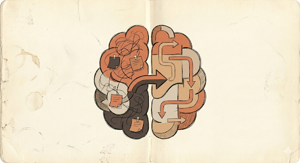

# 🧠 PM Brain-as-Code

[](https://creativecommons.org/licenses/by-nc-sa/4.0/) [](https://github.com/andreaskelm/pm-brain) [](https://github.com/andreaskelm/pm-brain/fork)

> **Your external product management brain. Single source of truth = latest commit.**

<p align="center"></p>

Product work is messy, and no one can keep all the important context in their brain.

You have probably felt this before:
- *"Sprint planning starts in 30 minutes, and we still do not have a clear prioritization call."*
- *"Leadership wants the strategy document by end of day, and I am still stitching context from Confluence, Jira tickets, old emails, and town hall slides from four months ago."*
- *"A stakeholder flips their position right before go-live, and now launch is postponed or canceled over something we could have pressure-tested upfront."*

**PM Brain is a git-versioned product management system plus an AI thinking partner.**

Think of it as an external knowledge base of frameworks, guides, templates, and playbooks that bridges PM theory and day-to-day execution. Your thinking has a home here. The workflow starts where real PM work starts: messy thinking first. The agent pushes a braindump before structure, challenges weak assumptions, and helps you build stronger critical thinking, judgment, intuition, and product sense through daily reps.

The core knowledge stays in one place: latest commit = current reality. Everything else can stay referenced (Confluence pages, Jira tickets, old emails) instead of trying to wire every source all the time.

From there, the flow is natural: thinking → strategy → discovery → execution → communication. You move from "brain soup" to clear artifacts without losing the nuance.

If this sounds like your world, start with [setup](docs/setup.md) below.

---

## Start here

**I'm a human.**  
→ [docs/setup.md](docs/setup.md) for installation and configuration.  
→ [docs/architecture.md](docs/architecture.md) for repo layers and methods flow.  
→ Browse [02-Methods-and-Tools/](02-Methods-and-Tools/) for frameworks.  
→ [docs/guidelines.md](docs/guidelines.md) for how to use and maintain.

**I'm an AI agent (Cursor / Claude Code / etc.).**  
→ Load [AGENTS.md](AGENTS.md) (persona), [ORCHESTRATION.md](ORCHESTRATION.md) (routing, states), [MEMORY.md](MEMORY.md) (what to wake when).  
→ Product thinking entry: [0-start-here-product-thinking.md](02-Methods-and-Tools/2.0-Foundations/2.0.1-Mental-Models/6-Product-Sense-Development/0-start-here-product-thinking.md).  
→ Template finder: [0-template-finder.md](02-Methods-and-Tools/0-template-finder.md).  
→ Golden rule: braindump before structure; check [PRODUCT-SENSE-RULES.md](PRODUCT-SENSE-RULES.md). Always check the filesystem before asking the user if context exists.

**I'm forking this for my company.**  
→ Fork the repo, then follow [docs/setup.md](docs/setup.md) (modes, Company Context, agent config).  
→ Fill `01-Company-Context/` with your context.  
→ Optional: append `.gitignore.private` or `.gitignore.team` to `.gitignore` (see [00-Meta/MODE-SELECTION-GUIDE.md](00-Meta/MODE-SELECTION-GUIDE.md)).

---

## 📦 What's inside

```text
pm-brain/
├── 00-Meta/                    # Personal practice (daily log, learning log, growth portfolio, Product Judgment Test)
├── 01-Company-Context/         # Vision, strategy, principles, stakeholders
├── 02-Methods-and-Tools/       # Frameworks, guides, templates (think → strategy → discovery → execution → communication)
├── 03-Research-Artifacts/     # Research storage
├── 04-Initiatives/             # Active bets (opportunity assessments, PRDs, docs)
└── docs/                       # Setup, guidelines, architecture, credits, agent-manifest
```

**Latest commit = current reality.** No stale Notion or Confluence pages.

---

## 💡 What this is / What it isn't

**What it is:**  
A practical PM system that helps you think better and execute faster. Keep core product knowledge in git, use frameworks and templates when needed, and let the agent guide messy thinking into clear artifacts.

**What it isn't:**  
Not a checkbox productivity hack, not a replacement for Jira/Confluence/Figma, and not a magic-prompt system. You still own the thinking and the decisions.

---

## 🚀 Get started (humans)

1. **Clone or fork** (fork recommended if you'll add company-specific context):
   ```bash
   git clone https://github.com/andreaskelm/pm-brain.git
   cd pm-brain
   ```
2. **Follow [docs/setup.md](docs/setup.md)** — Company Context, AI/agent config, optional 00-Meta setup.
3. **Use the repo** — Open a framework or start a conversation with the agent; it will guide you (think first, then structure, then templates).

**Using the agent (Cursor):** Open this repo in Cursor and start a chat. Say what you're working on ("I'm stuck on prioritization," "Help me think through this feature," "I need to write a PRD"). The agent will guide you and signal when it switches from exploring to structuring. Behavior is defined in [AGENTS.md](AGENTS.md), [ORCHESTRATION.md](ORCHESTRATION.md), and [MEMORY.md](MEMORY.md); see [.cursor/rules/](.cursor/rules/README.md).

**Use PM Brain in any project (Cursor only):**
```bash
npx skills add andreaskelm/pm-brain
```
Installs the workflow skill from [skills.sh](https://skills.sh/).

---

## 🏗️ Structure & navigation

- **Visual & design principles:** [docs/architecture.md](docs/architecture.md) — repo layers, methods flow, why the repo is structured this way.
- **Agent behavior:** [ORCHESTRATION.md](ORCHESTRATION.md) — routing, states, context loading; [MEMORY.md](MEMORY.md) — when to load company/initiatives/research.
- **I need a template:** [02-Methods-and-Tools/0-template-finder.md](02-Methods-and-Tools/0-template-finder.md).
- **Everything about a topic:** [02-Methods-and-Tools/1-frameworks-by-topic.md](02-Methods-and-Tools/1-frameworks-by-topic.md).
- **Evals:** [.cursor/evals/README.md](.cursor/evals/README.md) — when to run and where to update; see ORCHESTRATION.md → Eval Checkpoints.
- **How to use and maintain:** [docs/guidelines.md](docs/guidelines.md).

Product sense (think first, then structure) is built into the agent; see [PRODUCT-SENSE-RULES.md](PRODUCT-SENSE-RULES.md) and [0-start-here-product-thinking](02-Methods-and-Tools/2.0-Foundations/2.0.1-Mental-Models/6-Product-Sense-Development/0-start-here-product-thinking.md).

---

## 🤝 Contributing

- **Fork (private)** for company context: after forking, append `.gitignore.private` or `.gitignore.team` to `.gitignore`. See [00-Meta/MODE-SELECTION-GUIDE.md](00-Meta/MODE-SELECTION-GUIDE.md).
- **Contribute** improvements to the public repo (frameworks, guides, patterns); keep examples generic.

Conventions: follow folder/naming in the repo, clear commit messages, no proprietary info in examples.

---

## 👤 Created by [Andreas Kelm](https://github.com/andreaskelm)

⭐ Star if useful · 🔀 Fork to make it yours

---

## 📚 Credits & license

Frameworks from product management thought leaders. See [docs/credits.md](docs/credits.md).

CC BY-NC-SA 4.0 — view, use, modify, share with attribution; non-commercial. See [LICENSE](LICENSE).
