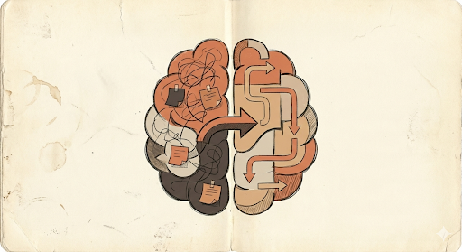

# 🧠 PM Brain-as-Code

[](https://creativecommons.org/licenses/by-nc-sa/4.0/) [](https://github.com/andreaskelm/pm-brain) [](https://github.com/andreaskelm/pm-brain/fork)

> **Your external product management brain-in-code. Single source of truth = latest commit.**

<p align="center"></p>

You have probably felt this before:

- *"Sprint planning starts in 30 minutes and we still do not have a clear prioritization call."*
- *"Leadership wants the strategy document by end of day, and I am still stitching context from Confluence, Jira tickets, old emails, and town hall slides from four months ago."*
- *"A stakeholder flips their position right before go-live, and launch is postponed or canceled over something we could have pressure-tested upfront."*

Product work is messy — a lot of the time it feels like brain soup. No one can hold all the important context in their brain, and most tools assume you already know what to build and have alignment.

**PM Brain is a git-versioned product management system with an AI coaching layer built for that reality — not the theory.** It gives your thinking a home, challenges your assumptions before you execute, and helps you survive the organizational politics that never show up in framework diagrams.

Everything lives in git. Latest commit = current reality. Confluence pages, Jira tickets, and slides stay referenced instead of trying to wire every source into one tool.

If this sounds like your world, you can skip down to [Getting started](#-getting-started).

---

## What it actually is

Most PM tools are built for execution. They assume the problem is already clear and the organization is already aligned.

PM Brain is built for everything that happens **before** that — the messy, ambiguous, politically loaded work of figuring out what is worth doing and getting people to agree.

**A thinking partner that defaults to challenge, not validation.**  
The PM Brain Coach agent does not start by handing you a template. It starts by asking for a braindump and then asks 3–5 uncomfortable questions before any structure is suggested. It stays in thinking mode until:

- Your assumptions are named  
- You have separated what you know from what you are guessing  
- At least one uncomfortable risk or second-order effect is on the table  

Only then does it move to execution frameworks and templates.

**An organizational survival system.**  
You build stakeholder avatars — profiles with goals, fears, incentives, real phrases, and historical behavior. You map power structures, alliances, fault lines, and veto holders. You log the “Red Weddings” so you do not walk into the same one twice. The agent can answer “What would my manager say about this?” with both an out-loud reaction and an inner monologue.

**A learning and growth system.**  
`5-Growth/` is not just a Product Judgment Test; it is your long-term practice loop:

- Daily and weekly logs where you capture what you tried and what actually happened  
- A Learning Log where you synthesize weekly and monthly patterns  
- A Growth Portfolio where you collect evidence for 1:1s, performance reviews, and your own narrative as a PM  
- A Product Judgment Test that uses weighted Brier scores on forecasts to calibrate your intuition over time  

Most PMs have no idea if their judgment is actually improving. This system gives you the reps **and** the evidence.

**Context that does not rot.**  
`system/MEMORY.md` defines what is “sleeping” and when to wake it. Company context, initiatives, research artifacts, and organizational-survival documents load only when the conversation touches them — not all at once as noise. When a long session needs continuity, capture durable state in `5-Growth/` or the relevant `3-Work/[initiative]/` artifact — not a separate checkpoint folder (see `system/ORCHESTRATION.md`).

**Platform-agnostic.**  
The repo works with Cursor, Claude Code, Claude.ai, ChatGPT, GitHub Copilot, or any AI tool that can take files as context. Bootstrap (every conversation, all platforms): `AGENTS.md` → `.cursor/rules/pm-brain.mdc` → `system/MEMORY.md` → `USER.md`. Routing detail: `system/ORCHESTRATION.md` (state entry, not bootstrap). Per-platform wiring: [docs/platform-setup.md](docs/platform-setup.md).

---

## What it is not

PM Brain is **not**:

- A productivity hack or checkbox system  
- A replacement for Jira, Confluence, or Figma — you link to those, you do not duplicate them  
- A magic-prompt generator that does the work for you  

You still own the thinking and the decisions. The agent is there to challenge, structure, and remember with you.

---

## How the agent works

The PM Brain Coach runs as a lightweight state machine defined in `system/ORCHESTRATION.md`. It operates in four modes:

- **product_sense** — Default when you are thinking through product, strategy, discovery, stakeholders, or organizational dynamics. The agent stays here, asking questions and using product-sense prompts, until a “braindump sufficient” checklist is met.
- **execution_mode** — After there is enough thinking on the table (or when you explicitly ask for a specific document), the agent routes to the right framework and template and guides you through it step by step.
- **meta_reflection** — After substantial decisions or discovery work, the agent suggests logging forecasts, learnings, and patterns in `5-Growth/` and (optionally) running evaluation checklists.
- **conversation** — Navigation, repo questions, and lightweight topics.

State transitions, loading rules, and context limits are all documented in [`system/ORCHESTRATION.md`](system/ORCHESTRATION.md) and [`docs/architecture.md`](docs/architecture.md).

---

## System structure

At the top level, the repo looks like this:

```text
pm-brain/
|-- AGENTS.md                  # Bootstrap — persona, principles, routing intent
|-- CLAUDE.md                  # Claude Code entry point
|-- USER.md                    # Your personal context
|-- .cursor/rules/pm-brain.mdc # Enforcement — voice, lenses, braindump floor
|-- system/                    # Agent infrastructure (MEMORY, orchestration, coaching, skills, evals)
|-- 1-Context/                 # Vision, strategy, stakeholders, org survival
|-- 2-Methods/                 # Frameworks, guides, templates
|-- 3-Work/                    # Active initiatives
|-- 4-Research/                # Research artifacts
|-- 5-Growth/                  # Practice loop (logs, PJT, portfolio)
|-- docs/                      # Setup, principles, architecture (see docs/README.md)
+-- .cursor/                   # Cursor rules, commands, skills wrappers, hooks
+-- .github/                   # Copilot instructions, CI workflows
```

**Latest commit = current reality.** No stale Notion or Confluence pages.

For a deeper architecture walkthrough and how loading works across layers and “sleeping memory,” see [`docs/architecture.md`](docs/architecture.md).

---

## The organizational survival layer

This is the part most PM systems ignore.

`1-Context/1.1-Stakeholder-Avatars/` holds your cast — one file per person. Each avatar captures:

- Explicit and implicit goals  
- Fears and incentives  
- Real phrases they use  
- Historical behavior and tells  

The `politics-coach` skill uses these to simulate reactions: out-loud response, inner monologue, top objections, and how to de-risk for that person specifically.

`1-Context/1.2-Organization-Survival/` maps the system:

- Power map — who formally owns decisions vs. who actually decides, who can quietly veto  
- Political landscape — alliances, fault lines, protected systems, narrative landmines  
- Stakeholder games — recurring behavior patterns and how to work with them  
- Coalitions and timing — what needs to be sequenced before big moves  
- Red flags and history — the “Red Weddings” log so you spot patterns earlier next time  

After a political incident or a “we should have seen this coming” moment, the agent nudges you to update these documents. The system learns from your actual organization, not an idealized one.

---

## Learning and growth system (`5-Growth/`)

`5-Growth/` is where you track what you **do**, what you **learn**, and how your **judgment** changes over time.

At a high level:

- **Daily & weekly practice** — quick notes on what you worked on, the bets you are making, and what surprised you.
- **Learning Log** (`1-Learning-Log/`) — weekly reflections and monthly syntheses where you step back and look for patterns rather than one-off incidents.
- **Growth Portfolio** (`2-Growth-Portfolio/`) — a living narrative and evidence file for 1:1s, performance reviews, promotion packets, and your own sense of progress.
- **Product Judgment Test** (`3-Product-Judgment-Test/`) — a Brier-score based system for logging forecasts before you ship and scoring them after outcomes resolve.

The loop looks like:

1. You do the daily work.  
2. You reflect weekly and monthly to notice patterns.  
3. You collect evidence of decisions and outcomes in your portfolio.  
4. You log forecasts before shipping and score them later to calibrate your intuition.  

The point is not being “right” all the time. A strong PM is calibrated: when you say 70%, you are right roughly 70% of the time. The Product Judgment Test gives you a measurable view of that calibration across different bet types and novelty levels.

Details and templates live in `5-Growth/README.md` and the subfolder READMEs.

---

## Evaluation system

PM Brain uses two related eval layers — do not conflate the naming:

- **Artifact QQC (methods “Level 1”).** Quick Quality Checks built into key frameworks (OKRs, roadmaps, PRDs, opportunity assessments, North Star, one-pagers). They run while you create artifacts to catch thin problem definitions, missing risks, or weak metrics. Rules: [system/EVALUATION.md](system/EVALUATION.md).
- **Harness tiers L0–L4 (`system/evals/`).** Repo health (L0), rubric regression (L1), behavior scenarios (L2), human review (L3), in-turn write hooks (L4). Use these to check whether the agent honored the golden rule, stayed in product_sense long enough, and surfaced meaningful risks.

Overview: [system/evals/README.md](system/evals/README.md). Fork CI and local commands: [docs/evals-fork.md](docs/evals-fork.md). Full architecture: [docs/architecture.md](docs/architecture.md).

The eval system exists so both **you** and the **agent** improve over time, based on real work rather than theory.

---

## 🚀 Getting started

You can use PM Brain either directly in an AI chat tool or in an IDE.

### Option 1: AI chat tools (Claude.ai, ChatGPT, Gemini, etc.)

1. Browse to the folder you need in this repo.  
2. Copy the relevant `README` + framework + template files.  
3. Paste them into your AI chat with a prompt like:  
   > “Here is my PM system. First, help me braindump my thoughts on **[topic]**. Challenge my assumptions and help me think before we structure anything.”  
4. Save that context in your AI tool’s project or workspace feature for reuse.

### Option 2: IDE tools (Cursor, VS Code + Copilot, Claude Code)

1. **Clone or fork** (fork recommended if you will add company-specific context):

   ```bash
   git clone https://github.com/andreaskelm/pm-brain.git
   cd pm-brain
   ```

2. **Follow [`docs/setup.md`](docs/setup.md)** — configure Company Context, privacy mode, and optional `5-Growth/` setup.
3. **Wire the agent per tool:** [`docs/platform-setup.md`](docs/platform-setup.md) — 4-file bootstrap and Cursor / Copilot / Claude Code entry points.
4. **Use the repo in your IDE** — open a framework or start a conversation with the agent; it will guide you (think first, then structure, then templates).

**Using the agent in Cursor.**
Open this repo in Cursor and start a chat. Say what you are working on (“I am stuck on prioritization,” “Help me think through this feature,” “I need to write a PRD”). The agent will guide you and signal when it switches from exploring to structuring. Bootstrap: `AGENTS.md` → `.cursor/rules/pm-brain.mdc` → `system/MEMORY.md` → `USER.md`. Platform wiring: [docs/platform-setup.md](docs/platform-setup.md).

**Use PM Brain in any project (Cursor only):**

```bash
npx skills add andreaskelm/pm-brain
```

Installs the workflow skill from `skills.sh` so you can bring PM Brain workflows into other repos.

---

## Who this is for

PM Brain is for:

- PMs at any level whose actual Tuesday mornings look nothing like LinkedIn thought-leadership threads.  
- Teams who want shared language and a living knowledge base that does not go stale.  
- Managers who want to make judgment, discovery, and strategy **visible** and coachable, not just outcomes.  

If you are tired of frameworks that assume the organization is already aligned and the problem is already obvious, this is for you.

---

## Daily workflow

On a typical day, the loop looks like this:

1. Open a conversation with the agent (or your AI tool of choice) with this repo as context.  
2. Describe what you are thinking through — messy is fine; that is the point.  
3. Stay in product_sense while the agent asks hard questions and surfaces risks.  
4. When the thinking is solid enough, let it route you to the right framework or template.  
5. After substantial work, log forecasts, decisions, or learnings in `5-Growth/`.  
6. Update company context, avatars, or organizational-survival documents when reality teaches you something new.  

Over time, this gives you both **better decisions** and a **paper trail of how you think**.

---

## Maintenance

This is meant to be a living system, not a giant document you touch once a year.

- **Living-document principle:** Update files when you use them. Let git be the changelog.  
- **Weekly:** Update active initiatives and — if you are using it — your Learning Log.  
- **Monthly:** Review frameworks you touched; update your Growth Portfolio and stakeholder avatars after key conversations.  
- **Quarterly:** Revisit company context, strategy, and OKRs.  
- **After political incidents:** Update organizational-survival documents, especially power maps and red flags.  

Small, regular updates beat big annual overhauls.

---

## Start here (quick navigation)

If you are new and just want the right entry point:

- **Setup & install:** [`docs/setup.md`](docs/setup.md)  
- **Agent wiring (bootstrap per platform):** [`docs/platform-setup.md`](docs/platform-setup.md)  
- **All human docs index:** [`docs/README.md`](docs/README.md)  
- **Architecture:** [`docs/architecture.md`](docs/architecture.md)  
- **Design principles & repo maintenance:** [`docs/principles.md`](docs/principles.md)  
- **Migrating from old folder layout:** [`docs/legacy-migration.md`](docs/legacy-migration.md)  
- **I want to think through a product decision:**  
  → [`system/coaching/README.md`](system/coaching/README.md)  
- **I know the document I need (PRD, OKR, roadmap, etc.):**  
  → [`0-template-finder.md`](2-Methods/0-template-finder.md)  
- **I want everything about a topic:**  
  → [`1-frameworks-by-topic.md`](2-Methods/1-frameworks-by-topic.md)  
- **I want to see or run evals:**  
  → [`system/evals/README.md`](system/evals/README.md) (fork CI/harness: [`docs/evals-fork.md`](docs/evals-fork.md))

Product sense (think first, then structure) is built into the agent; see `system/coaching/braindump.md` for the full golden-rule spec.

---

## 🤝 Contributing

- **Fork (private)** for real company context: after forking, tell the PM Brain agent your mode (public/private/team) and it will configure `.gitignore` and surface any sensitive files already tracked. See [`docs/setup.md`](docs/setup.md) → Step 3.  
- **Contribute back** improvements to the public template — new frameworks, better guides, clearer patterns. Keep examples generic and remove proprietary detail.  

Conventions: follow the existing folder and naming patterns, write clear commit messages, and prefer small, reviewable changes.

---

## Created by [Andreas Kelm](https://github.com/andreaskelm)

⭐ Star if useful · Fork to make it yours

---

## Credits & license

Frameworks build on the work of product management thought leaders. See [`docs/credits.md`](docs/credits.md) for attributions.

Licensed under **CC BY-NC-SA 4.0** — view, use, modify, and share with attribution for non-commercial purposes. See [`LICENSE`](LICENSE) for full terms.

