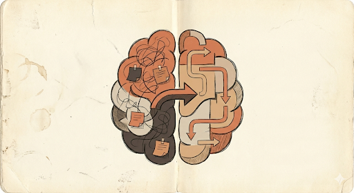

# 🧠 PM Brain-as-Code

[](https://creativecommons.org/licenses/by-nc-sa/4.0/) [](https://github.com/andreaskelm/pm-brain) [](https://github.com/andreaskelm/pm-brain/fork)

> **Your external product management brain-in-code. Single source of truth = latest commit.**

<p align="center"></p>

You have probably felt this before:

- *"Sprint planning starts in 30 minutes and we still do not have a clear prioritization call."*
- *"Leadership wants the strategy document by end of day, and I am still stitching context from Confluence, Jira tickets, old emails, and town hall slides from four months ago."*
- *"A stakeholder flips their position right before go-live, and launch is postponed or canceled over something we could have pressure-tested upfront."*

Product work is messy — a lot of the time it feels like brain soup. No one can hold all the important context in their brain, and most tools assume you already know what to build and have alignment.

**PM Brain is a git-versioned product management system with an AI coaching layer built for that reality — not the theory.** It gives your thinking a home, challenges your assumptions before you execute, and helps you survive the organizational politics that never show up in framework diagrams.

Everything lives in git. Latest commit = current reality. Confluence pages, Jira tickets, and slides stay referenced instead of trying to wire every source into one tool.

If this sounds like your world, you can skip down to [Getting started](#-getting-started).

---

## What it actually is

Most PM tools are built for execution. They assume the problem is already clear and the organization is already aligned.

PM Brain is built for everything that happens **before** that — the messy, ambiguous, politically loaded work of figuring out what is worth doing and getting people to agree.

**A thinking partner that defaults to challenge, not validation.**  
The PM Brain Coach agent does not start by handing you a template. It starts by asking for a braindump and then asks 3–5 uncomfortable questions before any structure is suggested. It stays in **product_sense** until all four [sufficiency criteria](system/coaching/braindump.md#sufficiency-criteria) are explicit:

- Named assumptions (not just the desired outcome)  
- Know vs. guess, separated clearly  
- At least one risk or second-order effect — “and then what?”  
- At least one uncomfortable thought that challenges the plan  

Only then does it move to skills, frameworks, and templates.

**An organizational survival system.**  
You build stakeholder avatars — profiles with goals, fears, incentives, real phrases, and historical behavior. You map power structures, alliances, fault lines, and veto holders. You log the “Red Weddings” so you do not walk into the same one twice. The agent can answer “What would my manager say about this?” with both an out-loud reaction and an inner monologue.

**A lean practice loop.**  
`5-Growth/` is deliberately small — [decisions.md](5-Growth/decisions.md) plus [weekly/](5-Growth/weekly/README.md). Log calls with confidence and reopen triggers before outcomes land; review weekly with the agent. Deeper reflection frameworks live in `2-Methods/1-Foundations/3-Self-Reflection/` if you want them; research insights belong in `4-Research/`, not in Growth.

**Context that does not rot.**  
The wake table in `AGENTS.md` defines what loads on demand. Company context, initiatives, and research load when the conversation touches them — not all at once. Long sessions: capture durable state in `5-Growth/` or `3-Work/[initiative]/` (see `system/ORCHESTRATION.md`).

**Platform-agnostic.**  
Cursor, Claude Code, VS Code Copilot, Claude.ai, ChatGPT, or any tool that can read repo files. Bootstrap: **`AGENTS.md`** (+ **`USER.md`** when present). Workflows: **`.claude/skills/`**; delegation: **`.claude/agents/`**. Routing: `system/ORCHESTRATION.md` at state entry. Wiring: [docs/platform-setup.md](docs/platform-setup.md) (model tiers, hooks, live evals).

---

## What it is not

PM Brain is **not**:

- A productivity hack or checkbox system  
- A replacement for Jira, Confluence, or Figma — you link to those, you do not duplicate them  
- A magic-prompt generator that does the work for you  

You still own the thinking and the decisions. The agent is there to challenge, structure, and remember with you.

---

## How the agent works

The PM Brain Coach runs as a lightweight state machine defined in `system/ORCHESTRATION.md`. It operates in four modes:

- **product_sense** — Default when you are thinking through product, strategy, discovery, stakeholders, or organizational dynamics. The agent stays here until the four sufficiency criteria in [braindump.md](system/coaching/braindump.md) are met for real, not on paper.
- **execution_mode** — After enough thinking (or an explicit doc request with preflight), the agent loads the matching **skill** in `.claude/skills/` and guides you through templates and quality checks.
- **meta_reflection** — After substantial decisions or discovery work, the agent suggests logging forecasts, learnings, and patterns in `5-Growth/` and (optionally) running evaluation checklists.
- **conversation** — Navigation, repo questions, and lightweight topics.

State transitions and loading rules: [`system/ORCHESTRATION.md`](system/ORCHESTRATION.md). Maintainer detail: [`docs/architecture.md`](docs/architecture.md).

---

## Skills and subagents

**Skills** (`.claude/skills/`) own workflows — PRD, OKR, roadmap, prioritize, opportunity assessment, politics-coach, weekly review, and more. Pick from the table in [2-Methods/0-index.md](2-Methods/0-index.md) or invoke with `/skill-name` where your platform supports it.

**Subagents** (`.claude/agents/`) handle mechanical or independent work: `context-scout` (repo scan), `artifact-reviewer` (QQC without grading your own draft), `stakeholder-simulator` (avatar-based reactions). Coaching and judgment calls stay in the main thread — see [AGENTS.md](AGENTS.md) → Delegation.

Install skills into another repo (Cursor): `npx skills add andreaskelm/pm-brain` (ships `.claude/skills/` from upstream).

---

## System structure

At the top level, the repo looks like this:

```text
pm-brain/
|-- AGENTS.md                  # Bootstrap — persona, voice, wake table
|-- USER.md                    # Your personal context
|-- .claude/skills/            # Workflows (PRD, OKR, prioritize, …)
|-- .claude/agents/            # Subagents (scout, reviewer, simulator)
|-- system/                    # Orchestration, coaching, evals
|-- 1-Context/                 # Vision, strategy, stakeholders, org survival
|-- 2-Methods/                 # Reference — mental models, guides (0-index → skills)
|-- 3-Work/                    # Active initiatives
|-- 4-Research/                # Research artifacts
|-- 5-Growth/                  # decisions.md + weekly/
|-- docs/                      # Setup, principles, architecture (docs/README.md)
+-- .cursor/                   # Hooks (Cursor)
+-- .github/                   # CI workflows
```

**Latest commit = current reality.** Maintainer architecture: [`docs/architecture.md`](docs/architecture.md).

---

## The organizational survival layer

This is the part most PM systems ignore.

`1-Context/1.1-Stakeholder-Avatars/` holds your cast — one file per person. Each avatar captures:

- Explicit and implicit goals  
- Fears and incentives  
- Real phrases they use  
- Historical behavior and tells  

The `politics-coach` skill uses these to simulate reactions: out-loud response, inner monologue, top objections, and how to de-risk for that person specifically.

`1-Context/1.2-Organization-Survival/` maps the system:

- Power map — who formally owns decisions vs. who actually decides, who can quietly veto  
- Political landscape — alliances, fault lines, protected systems, narrative landmines  
- Stakeholder games — recurring behavior patterns and how to work with them  
- Coalitions and timing — what needs to be sequenced before big moves  
- Red flags and history — the “Red Weddings” log so you spot patterns earlier next time  

After a political incident or a “we should have seen this coming” moment, the agent nudges you to update these documents. The system learns from your actual organization, not an idealized one.

---

## Practice loop (`5-Growth/`)

`5-Growth/` is intentionally minimal — two artifacts:

- **[decisions.md](5-Growth/decisions.md)** — decisions worth remembering, with confidence, reopen trigger, outcome, and calibration when you know it. The agent offers a row when you state a decision with a confidence level.
- **[weekly/](5-Growth/weekly/README.md)** — one short note per week: live assumptions, drift, what you are avoiding. Drafted in the weekly review skill; you correct it.

The point is calibration, not paperwork: when you say 70%, are you right about seven times out of ten? Background: [calibration](2-Methods/1-Foundations/1-Mental-Models/1-Decision-Making/8-calibration.md). Full rationale: [5-Growth/README.md](5-Growth/README.md).

---

## Evaluation system

PM Brain uses two related eval layers — do not conflate the naming:

- **Artifact QQC (methods “Level 1”).** Quick Quality Checks built into key frameworks (OKRs, roadmaps, PRDs, opportunity assessments, North Star, one-pagers). They run while you create artifacts to catch thin problem definitions, missing risks, or weak metrics. Rules: [system/EVALUATION.md](system/EVALUATION.md).
- **Harness tiers L0–L4 (`system/evals/`).** Repo health (L0), rubric regression (L1), behavior scenarios (L2), human review (L3), in-turn write hooks (L4). Use these to check whether the agent honored the golden rule, stayed in product_sense long enough, and surfaced meaningful risks.

Overview: [system/evals/README.md](system/evals/README.md). CI and local commands: [docs/evals-fork.md](docs/evals-fork.md).

---

## 🚀 Getting started

You can use PM Brain either directly in an AI chat tool or in an IDE.

### Option 1: AI chat tools (Claude.ai, ChatGPT, Gemini, etc.)

1. Browse to the folder you need in this repo.  
2. Copy the relevant `README` + framework + template files.  
3. Paste them into your AI chat with a prompt like:  
   > “Here is my PM system. First, help me braindump my thoughts on **[topic]**. Challenge my assumptions and help me think before we structure anything.”  
4. Save that context in your AI tool’s project or workspace feature for reuse.

### Option 2: IDE tools (Cursor, VS Code + Copilot, Claude Code)

1. **Clone or fork** (fork recommended if you will add company-specific context):

   ```bash
   git clone https://github.com/andreaskelm/pm-brain.git
   cd pm-brain
   ```

2. **Follow [`docs/setup.md`](docs/setup.md)** — configure Company Context, privacy mode, and optional `5-Growth/` setup.
3. **Wire the agent per tool:** [`docs/platform-setup.md`](docs/platform-setup.md) — AGENTS.md bootstrap, skills, model tiers.
4. **Use the repo in your IDE** — open a framework or start a conversation with the agent; it will guide you (think first, then structure, then templates).

**Using the agent in Cursor.**
Open this repo in Cursor and start a chat. Say what you are working on (“I am stuck on prioritization,” “Help me think through this feature,” “I need to write a PRD”). The agent will guide you and signal when it switches from exploring to structuring. Bootstrap: `AGENTS.md` + `USER.md`. Platform wiring: [docs/platform-setup.md](docs/platform-setup.md).

**Use PM Brain skills in another repo (Cursor):** `npx skills add andreaskelm/pm-brain` — installs `.claude/skills/` from upstream.

---

## Who this is for

PM Brain is for:

- PMs at any level whose actual Tuesday mornings look nothing like LinkedIn thought-leadership threads.  
- Teams who want shared language and a living knowledge base that does not go stale.  
- Managers who want to make judgment, discovery, and strategy **visible** and coachable, not just outcomes.  

If you are tired of frameworks that assume the organization is already aligned and the problem is already obvious, this is for you.

---

## Daily workflow

On a typical day, the loop looks like this:

1. Open a conversation with the agent (or your AI tool of choice) with this repo as context.  
2. Describe what you are thinking through — messy is fine; that is the point.  
3. Stay in product_sense while the agent asks hard questions and surfaces risks.  
4. When the thinking is solid enough, let it route you to the right framework or template.  
5. After substantial work, log forecasts, decisions, or learnings in `5-Growth/`.  
6. Update company context, avatars, or organizational-survival documents when reality teaches you something new.  

Over time, this gives you both **better decisions** and a **paper trail of how you think**.

---

## Maintenance

This is meant to be a living system, not a giant document you touch once a year.

- **Living-document principle:** Update files when you use them. Let git be the changelog.  
- **Weekly:** Update active initiatives; run the weekly review skill if you use `5-Growth/weekly/`.  
- **Monthly:** Review frameworks you touched; update stakeholder avatars after key conversations.  
- **Quarterly:** Revisit company context, strategy, and OKRs.  
- **After political incidents:** Update organizational-survival documents, especially power maps and red flags.  

Small, regular updates beat big annual overhauls.

---

## Start here (quick navigation)

If you are new and just want the right entry point:

- **Setup & install:** [`docs/setup.md`](docs/setup.md)  
- **Agent wiring (AGENTS.md + skills per platform):** [`docs/platform-setup.md`](docs/platform-setup.md)  
- **All human docs index:** [`docs/README.md`](docs/README.md)  
- **Architecture:** [`docs/architecture.md`](docs/architecture.md)  
- **Design principles & repo maintenance:** [`docs/principles.md`](docs/principles.md)  
- **Migrating from old folder layout:** [`docs/legacy-migration.md`](docs/legacy-migration.md)  
- **I want to think through a product decision:**  
  → [`system/coaching/README.md`](system/coaching/README.md)  
- **I know the workflow I need (PRD, OKR, roadmap, etc.):**  
  → [`2-Methods/0-index.md`](2-Methods/0-index.md) → `.claude/skills/`  
- **I want to see or run evals:**  
  → [`system/evals/README.md`](system/evals/README.md) (CI/harness: [`docs/evals-fork.md`](docs/evals-fork.md))

Product sense (think first, then structure) is built into the agent; see `system/coaching/braindump.md` for the full golden-rule spec.

---

## 🤝 Contributing

- **Fork (private)** for real company context: after forking, tell the PM Brain agent your mode (public/private/team) and it will configure `.gitignore` and surface any sensitive files already tracked. See [`docs/setup.md`](docs/setup.md) → Step 3.  
- **Contribute back** improvements to the public template — new frameworks, better guides, clearer patterns. Keep examples generic and remove proprietary detail.  

Conventions: follow the existing folder and naming patterns, write clear commit messages, and prefer small, reviewable changes.

---

## Created by [Andreas Kelm](https://github.com/andreaskelm)

⭐ Star if useful · Fork to make it yours

---

## Credits & license

Frameworks build on the work of product management thought leaders. See [`docs/credits.md`](docs/credits.md) for attributions.

Licensed under **CC BY-NC-SA 4.0** — view, use, modify, and share with attribution for non-commercial purposes. See [`LICENSE`](LICENSE) for full terms.

