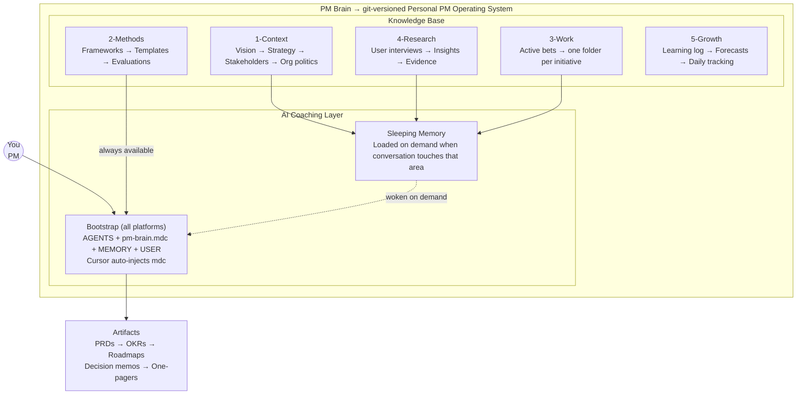
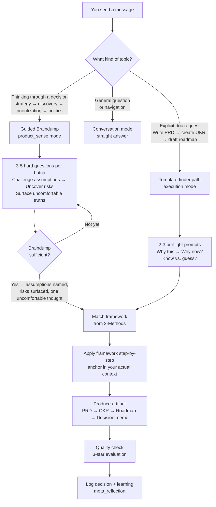
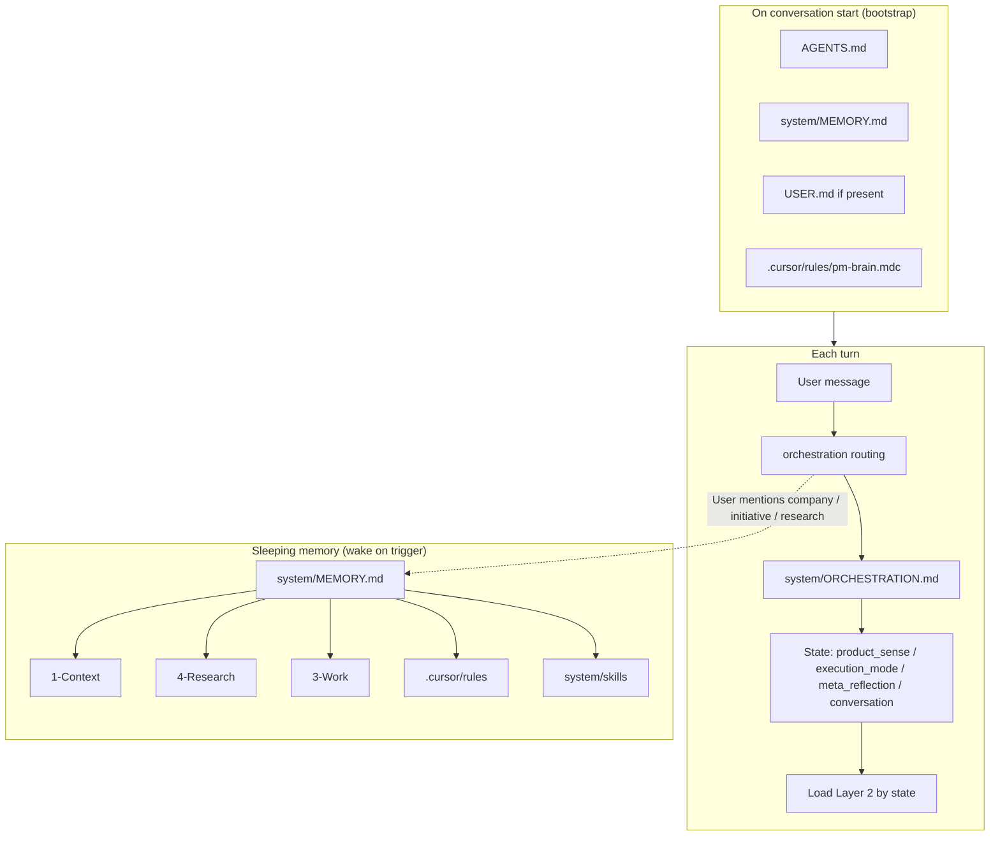
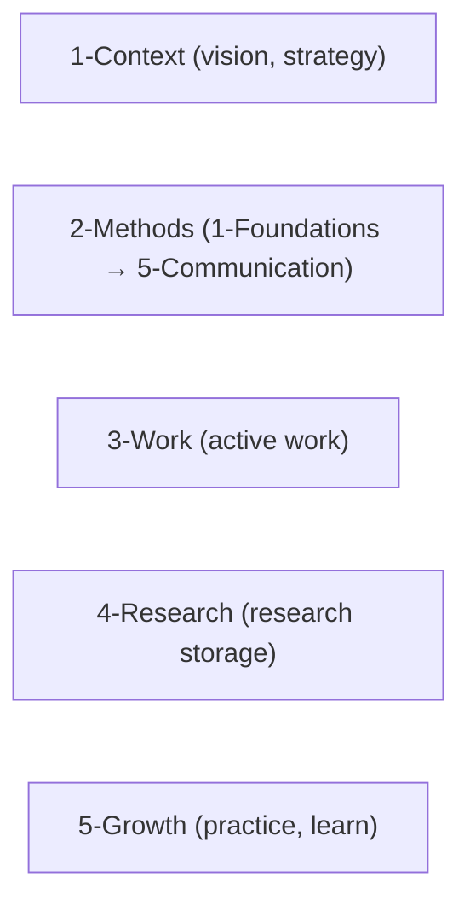
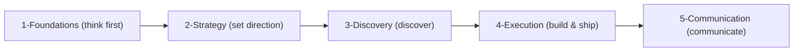
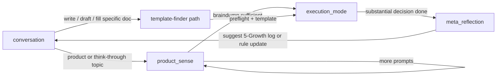
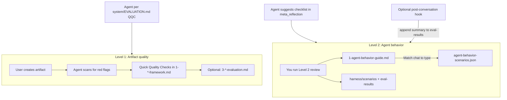
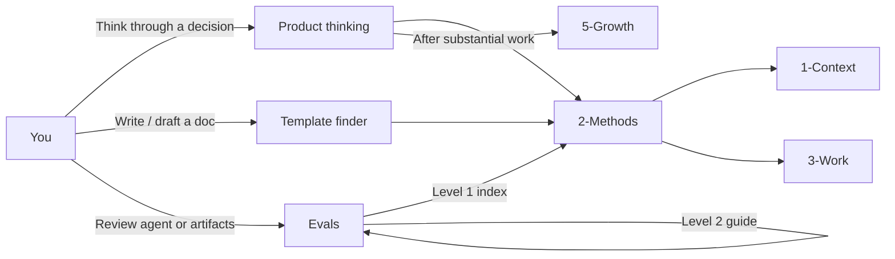
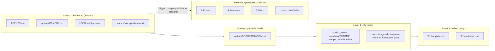

# PM Brain → Architecture Overview

**What this file is:** Short visual reference for repo structure and methods flow. **This is documentation for humans (and for agents when they need a system overview); it is not executed behavior.** Executed behavior lives in [system/ORCHESTRATION.md](../system/ORCHESTRATION.md). For full navigation: [README.md](../README.md), [docs/README.md](README.md), [AGENTS.md](../AGENTS.md), [system/ORCHESTRATION.md](../system/ORCHESTRATION.md), [system/MEMORY.md](../system/MEMORY.md). For a short reference summary (not loaded by the agent): [agent-manifest.md](agent-manifest.md). For product thinking: [system/coaching/README.md](../system/coaching/README.md). For "I need a template?": [0-template-finder.md](../2-Methods/0-template-finder.md). For "everything about topic X?": [1-frameworks-by-topic.md](../2-Methods/1-frameworks-by-topic.md). For evals (methods + agent behavior): [system/evals/README.md](../system/evals/README.md). Fork eval CI: [evals-fork.md](evals-fork.md).

**Preview:** The built-in Markdown preview in Cursor (and VS Code) does not render Mermaid diagrams by default. To see flowcharts and diagrams in preview, install a Mermaid-capable extension (e.g. **Markdown Preview Mermaid Support** or **Mermaid Preview** from the Extensions view). Diagrams in this file also render on GitHub and in online Mermaid editors.

---

## At a glance

Two diagrams that explain the whole system. Useful for onboarding someone new or explaining what this is.

**What PM Brain is → structure:**

**How a coaching session flows:**

**The short pitch:** A personal PM knowledge base with a built-in thinking coach. Every conversation is grounded in your actual company context, uses a curated library of PM frameworks, and pushes you to think clearly before producing polished docs.

├──

## Design Principles

User-facing summary: [principles.md](principles.md). This section documents **why** the repo is structured this way for maintainers evaluating structural changes (e.g. adding root files, moving agent config, refactoring).

### Root file policy

- **Root is reserved for:** (a) files AI platforms expect at root by convention (AGENTS.md, CLAUDE.md), (b) bootstrap files the agent loads at conversation start (AGENTS.md, `.cursor/rules/pm-brain.mdc`, system/MEMORY.md, USER.md if present), (c) platform entry points (`.cursor/rules/pm-brain.mdc`, `.github/copilot-instructions.md`). Human docs live in `docs/`. Version history lives in git — no separate manifest file required.
- **Human documentation** goes in `docs/`, not at root.
- Adding a new root file requires justification against these criteria.

### Loading layer rationale

- **Layer 1** (bootstrap) is the small set loaded at conversation start on **every platform**: **AGENTS.md**, **`.cursor/rules/pm-brain.mdc`**, **system/MEMORY.md**, **USER.md** (if present). Cursor auto-injects `pm-brain.mdc`; Claude Code and Copilot must read it explicitly via their entry-point checklists. Keep it lean — every line here costs context on every conversation regardless of topic.
- **system/ORCHESTRATION.md** loads at **state entry**, not bootstrap — when the agent needs routing detail for the current mode.
- A file belongs in Layer 1 only if the agent needs it on **every** turn. Everything else is Layer 2+ (on-demand).
- Example: system/coaching/braindump.md is Layer 2 because it is only needed in product_sense state → putting it in Layer 1 would waste context on every non-product conversation.

### Separation of concerns

- **AGENTS.md** = WHO (persona, pointers) → slim, Layer 1.
- **system/ORCHESTRATION.md** = WHAT (routing, states, loading) → Layer 2, loaded at state entry.
- **system/MEMORY.md** = WHERE (sleeping memory, path mapping) → Layer 1 bootstrap, consulted on trigger.
- **system/coaching/braindump.md** = HOW the golden rule works (full spec) → Layer 2.
- **`.cursor/rules/pm-brain.mdc`** = always-on enforcement (voice, lenses, braindump floor) → Layer 1 on all platforms; Cursor auto-injects, others read explicitly.
- Each file has one job; if you cannot describe it in one sentence, consider splitting.

### Why pm-brain.mdc exists

`pm-brain.mdc` overlaps with [AGENTS.md](../AGENTS.md) on lenses and the golden rule — that overlap is intentional, not accidental drift.

| Platform | Why keep it |
|----------|-------------|
| **Cursor** | `alwaysApply: true` injects enforcement without trusting the agent to read bootstrap. Evals show bootstrap reads get skipped in real sessions. |
| **Claude Code / Copilot / paste** | Not physically required if bootstrap is read faithfully — but it carries full voice rules and expanded lens language that AGENTS only summarizes. Included in the 4-file bootstrap for one enforcement source across platforms. |

**Tradeoff:** Reading both AGENTS and mdc costs context every turn. The alternative — collapse everything into AGENTS and drop mdc — saves tokens but weakens Cursor reliability unless you move enforcement into a different always-on mechanism.

**When editing behavior:** Update lenses/principles in AGENTS for persona; update enforcement detail (voice, braindump criteria, minimal footprint) in mdc. If you change one, check the other for drift.

### Platform agnosticism

- AGENTS.md at root is a cross-platform convention (Cursor, Claude Code, GitHub Copilot).
- CLAUDE.md at root is a Claude Code requirement (auto-discovered).
- Platform-specific paths are routed through system/MEMORY.md, never hardcoded in AGENTS.md or system/ORCHESTRATION.md.
- Any structural change must work on Cursor **and** Claude Code without extra configuration.

### Platform-specific wiring

Each platform has a different auto-load mechanism. The CONTENT is shared (same rules, same persona, same orchestration), but the WIRING → how that content gets into the agent's context → is platform-specific. Don't try to make one folder or one file serve all platforms; instead, create the entry point each platform needs and point it at the shared content.

| Platform | Entry point | What it does |
|----------|------------|-------------|
| **Cursor** | `.cursor/rules/*.mdc` | Auto-injects rules into every conversation. No read step needed. |
| **VS Code + Copilot** | `.github/copilot-instructions.md` | Auto-loads as system prompt; instructs agent to read shared bootstrap files. |
| **Claude Code** | `CLAUDE.md` | Auto-discovered by Claude; contains manual setup checklist pointing at shared files. |
| **ChatGPT / Claude.ai** | None (manual) | User pastes bootstrap context; see `docs/platform-setup.md`. |

**Principle:** One content set, platform-specific wiring. When adding a new rule or changing agent behavior, update the CONTENT (shared files). When supporting a new platform, create a new ENTRY POINT that wires to the same content. Don't duplicate content across entry points → except for critical guardrails (like the golden rule) that must survive even if the bootstrap is skipped.

### Structural "do nots"

- Do **not** create JSON manifests duplicating the filesystem (they go stale).
- Do **not** pre-declare frameworks as enabled/disabled (fights the repo philosophy).
- Do **not** move agent core files into subdirectories for tidiness (breaks conventions).
- Do **not** merge large Layer 2 files into Layer 1 files (wastes context budget).

### Naming conventions

- **Root:** UPPERCASE for agent/core docs (AGENTS.md, CLAUDE.md); README.md. Routing lives in `system/ORCHESTRATION.md`. New human docs go in `docs/` as lowercase.
- **docs/:** lowercase hyphenated (setup.md, principles.md, architecture.md, credits.md, agent-manifest.md).
- **2-Methods:** README.md plus `N-name-with-hyphens.md` (number prefix, lowercase).
- **1-Context:** Entry UPPERCASE (CONTEXT-HEALTH.md); content number-lowercase (1-company-vision.md, etc.). Personal + work quick context in root `USER.md`. Setup guide lives in `docs/setup.md`.
- **3-Work:** lowercase (summary.md, prd.md, opportunity-assessment.md, roadmap.md, decisions.md).
- **5-Growth:** Content lowercase; entry/guide docs may stay UPPERCASE. No UPPERCASE in otherwise lowercase folders → fix outliers.
- **.cursor:** lowercase hyphenated for rules/skills; consolidated always-on rule is **`pm-brain.mdc`**.

├──

## System overview (how the agent runs)

High-level flow: the agent loads a small core at conversation start, infers state from your message, and loads more context only when needed. Sleeping memory is woken only when the conversation touches that area.

**In words:**
- **Start (bootstrap):** Agent reads **AGENTS.md**, **`.cursor/rules/pm-brain.mdc`**, **system/MEMORY.md**, and **USER.md** (if present) on every platform. Cursor auto-injects `pm-brain.mdc` via `alwaysApply: true`; Claude Code and Copilot read it via bootstrap checklists in their entry points. **system/ORCHESTRATION.md** loads at state entry — not bootstrap.
- **Each turn:** Your message is matched against orchestration's decision tree → one mode is chosen (product_sense, execution_mode, meta_reflection, or conversation). The agent then loads only the Layer 2 files for that mode (e.g. coaching/README + prompts for product_sense; template-finder + framework for execution_mode).
- **Cross-cutting behaviors:** Some rules fire in ANY state, regardless of mode: the Product Judgment Test capture trigger (decision with confidence → offer PJT), intent disambiguation (clarify ambiguous topic signals before loading), the company context routing guard (check CONTEXT-HEALTH.md before suggesting updates to company docs), and synthesis-first (when user signals they're about to share content, ask for their takeaways before analyzing).
- **Sleeping memory:** 1-Context, 4-Research, 3-Work, and `system/skills/` (on-demand) are **not** in the prompt until the conversation touches them. When you mention strategy, an initiative, or research, the agent consults system/MEMORY.md and loads the relevant paths. This keeps the prompt small and focused.

├──

## Repo layers

The repo has five main folders at the top level. Each holds a different kind of content. The diagram below shows them side by side; the list and table follow.

**Visual:**

**The five folders (1–5):**

- **1-Context** → vision, strategy, stakeholders
- **2-Methods** — frameworks, guides, templates (`1-Foundations` → `5-Communication`)
- **3-Work** → active work, one folder per bet
- **4-Research** → research storage
- **5-Growth** → practice, learning log, growth portfolio, Product Judgment Test

| # | Area | Purpose |
|---|------|---------|
| **1** | **1-Context** | Your company's direction and constraints. Customize; keep current. |
| **2** | **2-Methods** | Reusable frameworks (`1-Foundations` → `5-Communication`). Flow below. |
| **3** | **3-Work** | One folder per bet; day-to-day product work. |
| **4** | **4-Research** | Research storage. Link to initiatives. |
| **5** | **5-Growth** | What you *do* and *learn* → daily log, learning log, growth portfolio, Product Judgment Test. Canonical prompts/templates live in `2-Methods/1-Foundations/1-Mental-Models/6-Product-Sense-Development/`. |

├──

## Methods flow (2-Methods)

Inside `2-Methods/` you work in this order: **think** (Foundations) → **set direction** (Strategy) → **discover** (Discovery) → **build and ship** (Execution), while **communicating** all along (Communication). The diagram below shows the flow; the table follows.

**Visual (flow, left to right):**

**Flow (text):** `1-Foundations` → `2-Strategy` → `3-Discovery` → `4-Execution` → `5-Communication`

| Layer | Contents |
|-------|----------|
| **1-Foundations** | Think first — product sense entry, mental models, bias. Start here before templates. |
| **2-Strategy** | Direction, goals, roadmap, prioritization. |
| **3-Discovery** | Research, JTBD, opportunity assessment, idea validation. |
| **4-Execution** | PRDs, personas, metrics, execution rituals. |
| **5-Communication** | Stakeholder communication, one-pagers, crisis, escalation, saying no. |

├──

## Agent mode flow (state diagram)

The assistant operates in four **modes**: **product_sense**, **execution_mode**, **meta_reflection**, and **conversation**. The template-finder path is an **entry path** into execution_mode (when the user asks to write/draft/fill a specific doc), not a separate mode.

- **Default posture: product_sense** — develop product sense through braindump unless there's an explicit doc request or non-product navigation. Re-route via the decision tree in [system/ORCHESTRATION.md](../system/ORCHESTRATION.md).
- **product_sense**: Entered when the topic is product/stakeholder/organization/strategy/roadmap/prioritization/discovery/execution or "help me think through something". Load [system/coaching/README.md](../system/coaching/README.md); stay in braindump using [prompts.md](../system/coaching/prompts.md) and the golden rule in [braindump.md](../system/coaching/braindump.md) until the sufficiency checklist is met.
- **Template finder path** (entry into execution_mode): When you ask to write/draft/fill a specific doc (PRD, OKR, one-pager, etc.), use [0-template-finder.md](../2-Methods/0-template-finder.md) to jump to the right README + template, with 1–2 preflight prompts for non-trivial docs.
- **execution_mode**: After sufficient braindump (or via template-finder path), help structure thinking and apply the right framework/template from `2-Methods/`.
- **meta_reflection**: After substantial decision work, suggest logging in `5-Growth/` (forecast log, learning log, pattern recognition), optionally running the Level 2 checklist ([system/evals/1-agent-behavior-guide.md](../system/evals/1-agent-behavior-guide.md)), and optionally updating rules (see `AGENTS.md`).
- **conversation**: Navigation, non-product topics. Re-route when product or doc-request triggers appear.

**Evals** are a separate workflow (see Evaluation system below), not a conversation mode. The agent may suggest the Level 2 checklist in meta_reflection; you run evals when you choose.

├──

## Cross-cutting behaviors (fire in any state)

Some agent behaviors are **unconditional** — they fire regardless of which mode the agent is in. These are defined in [system/ORCHESTRATION.md](../system/ORCHESTRATION.md) → Cross-Cutting (any state):

- **Product Judgment Test capture:** Any time a decision is captured with an explicit confidence level (anywhere, any state), the agent immediately offers to log it in the [Product Judgment Test](../5-Growth/3-Product-Judgment-Test/forecast-log.md). This is hardcoded, not a judgment call.
- **Intent disambiguation:** When a topic signal is ambiguous (e.g. "roadmap" could mean "load company roadmap" or "help me build a roadmap"), the agent states its interpretation and checks before loading → one brief confirmation, not an interrogation.
- **Company context routing guard:** Before suggesting an update to any numbered company context doc, the agent checks [CONTEXT-HEALTH.md](../1-Context/CONTEXT-HEALTH.md) for its Maintained/Reference/External status. Reference or External docs route findings to initiative context instead. Stakeholder Avatars are always Maintained.

├──

## Evaluation system (evals)

Evals use two naming schemes — do not conflate them:

- **Harness tiers (L0–L4):** Architecture levels in [system/evals/README.md](../system/evals/README.md) — repo health (L0), rubric regression (L1), behavior scenarios (L2), human review (L3), in-turn write hooks (L4).
- **Artifact QQC ("Level 1" in methods):** Quick Quality Checks in `2-Methods/` frameworks during artifact creation, per [system/EVALUATION.md](../system/EVALUATION.md). This is not the same as harness L1.

Maintainers: CI, harness commands, and private-fork merge policy → [evals-fork.md](evals-fork.md). **Entry:** [system/evals/README.md](../system/evals/README.md).

**How evals are used (visual):**

- **Artifact QQC during creation:** The agent uses Quick Quality Checks from [system/EVALUATION.md](../system/EVALUATION.md) when you work on frameworks with evaluation support (PRD, Opportunity Assessment, North Star, One-Pager, OKR, Roadmap). Coaching enforcement via `pm-brain.mdc` on all platforms (Cursor auto-injects; others read explicitly).
- **L2 behavior evals:** Harness scenarios (`run_scenario.py`) for automated regression; human transcript review via [1-agent-behavior-guide.md](../system/evals/1-agent-behavior-guide.md). [agent-behavior-scenarios.json](../system/evals/agent-behavior-scenarios.json) is a discovery index; ground truth is each scenario's `expected.yaml` plus [behavior-assertions.md](../system/evals/behavior-assertions.md). See also [2-checklist.md](../system/evals/2-checklist.md).
- **Entry point:** [system/evals/README.md](../system/evals/README.md).
- **Hooks:** `system/evals/hooks/validate_write.py` (in-turn), `.cursor/hooks/trigger-self-critique.js` (stop). See [eval-functions.md](../system/evals/eval-functions.md) for implementation pointers.

├──

## How the repo is used (entry points and flows)

The repo has a few main entry points. Depending on what you're doing, the agent (or you) routes to the right place. The diagram below shows how those entry points connect to the rest of the repo.

**Where to start (quick reference):**

| I want to... | Go to |
|--------------|-------|
| **Think through a product decision** | [system/coaching/README.md](../system/coaching/README.md) → braindump first, then frameworks |
| **I know the doc I need** (PRD, OKR, roadmap, etc.) | [0-template-finder.md](../2-Methods/0-template-finder.md) → jump straight to template |
| **Understand the system architecture** | [architecture.md](architecture.md) → visual overview, flows, context management |
| **Configure the agent / orchestration** | [AGENTS.md](../AGENTS.md) → persona; [`.cursor/rules/pm-brain.mdc`](../.cursor/rules/pm-brain.mdc) → enforcement; [system/MEMORY.md](../system/MEMORY.md) → sleeping memory; [platform-setup.md](platform-setup.md) → per-platform wiring. Bootstrap = those four files. [system/ORCHESTRATION.md](../system/ORCHESTRATION.md) → routing at state entry. |
| **Quick reference** (not loaded by agent) | [agent-manifest.md](agent-manifest.md) → summary of entrypoints, states, and content clusters; for humans and maintainers only |
| **Run evals** (artifact quality or agent behavior) | [system/evals/README.md](../system/evals/README.md) → Level 1 (methods) or Level 2 (agent behavior) |
| **Set up for the first time** | [docs/setup.md](setup.md) → company context, agent config, optional 5-Growth setup |

| Entry point | Trigger | Where it leads |
|-------------|---------|----------------|
| **Product thinking** | You're braindumping, exploring, or asking for help with a decision | [system/coaching/README.md](../system/coaching/README.md) → product_sense → then [2-Methods/](../2-Methods/README.md) (framework/template). After substantial work, agent may suggest [5-Growth/](../5-Growth/README.md) (log, forecast, learning). |
| **Template finder** | You ask to write/draft/fill a specific doc (PRD, OKR, one-pager, etc.) | [0-template-finder.md](../2-Methods/0-template-finder.md) → right README + template in 2-Methods. For frameworks with evaluation support, agent uses Quick Quality Checks ([EVALUATION.md](../system/EVALUATION.md)). |
| **Evals** | You want to review artifact quality or agent behavior | [system/evals/README.md](../system/evals/README.md) → Level 1 (Methods) or Level 2 (agent-behavior guide, checklist, scenarios as reference). Agent may suggest Level 2 checklist after substantial conversations (meta_reflection). |

├──

## Linking Conventions

**Cross-domain references:** Point to domain `README.md` files (e.g., `1-Foundations/README.md`, `2-Strategy/README.md`). These serve as stable entry points for each domain.

**Within-domain references:**
- Use sibling links for closely related files (e.g., `1-framework.md`, `2-template.md`)
- Use `../README.md` to reference the domain index
- Use stable paths for nearby subdomains (e.g., `../2-Bias/README.md`)

**Deep links:** Only use deep links (e.g., `../../1-Foundations/3-Self-Reflection/README.md`) when specifically referencing a particular framework in context, or in "Related frameworks" sections. Prefer domain indices for general navigation.

**Agent guidance placement:** "For Agents" sections (agent-facing instructions on when/how to suggest frameworks) must appear **at the very top** of the document so the agent sees them first (avoids lost-in-middle and ensures consistent behavior). Convention:
- **If a framework folder has `1-*-framework.md`:** Place "For Agents" section in `1-*-framework.md` at the top (immediately after the main title and optional one-line description). The folder `README.md` serves as human-facing index/navigation only.
- **If a framework folder does NOT have `1-*-framework.md`:** Place "For Agents" section in the folder `README.md` at the top (after the main title).

This keeps agent-facing instructions visible first when the file is loaded; human-facing content (overview, methodology, templates) follows below.

**Numbering:** `N-Name` at every folder level under content folders (`2-Methods/`, `5-Growth/`, etc.) → see [2-Methods/README.md](../2-Methods/README.md) → Numbering convention. No legacy decimal prefixes (`0.1-`, `2.x.y`). Example: `5-Growth/1-Learning-Log/`, `5-Growth/4-Coaching-Templates/`.

**When adding new frameworks:** Follow these conventions to maintain consistent navigation patterns.

├──

## Context Management Strategy

The agent loads different files at different times to stay within context limits. **Definitive loading logic:** [system/ORCHESTRATION.md](../system/ORCHESTRATION.md) → Context Loading Strategy. **Sleeping memory manifest:** [system/MEMORY.md](../system/MEMORY.md).

**Visual (what gets loaded when):**

**Three layers, short version:**
- **Layer 1 (bootstrap):** AGENTS.md + `.cursor/rules/pm-brain.mdc` + system/MEMORY.md + USER.md (if present) on every platform. Cursor auto-injects mdc; Claude Code and Copilot read it via entry-point checklists. ORCHESTRATION loads at state entry — not bootstrap.
- **Layer 2 (by mode):** Loaded when a mode is entered — product_sense gets coaching/README + prompts + eval-functions; execution_mode gets template-finder or framework guide.
- **Layer 3 (reference):** Templates (`2-*-template.md`) and evaluations (`3-*-evaluation.md`) loaded only when actively filling or checking.
- **Sleeping memory:** Company context, research, initiatives, and skills (`system/skills/`) load only when the conversation touches that area — triggered by user message, routed via system/MEMORY.md.

For the full file-by-file loading table, see [system/ORCHESTRATION.md](../system/ORCHESTRATION.md) → Context Loading Table.

**For framework authors:** Keep framework guides focused. Put detailed examples in separate files. Keep "For Agents" sections concise.

### Context Health (Preventing Rot)

Long conversations degrade quality as context fills up. At state transitions or ~25–30 turn ceiling, the agent suggests a **fresh conversation** using native platform session continuity (Cursor resume, Claude thread) — after capturing durable state in `5-Growth/` or `3-Work/`. Full protocol: [system/ORCHESTRATION.md](../system/ORCHESTRATION.md) → Context Health.

---

## Version Management

Version history lives in git. See [principles.md](principles.md) for the golden record and minimal footprint principles. No separate `version.json` is required.
