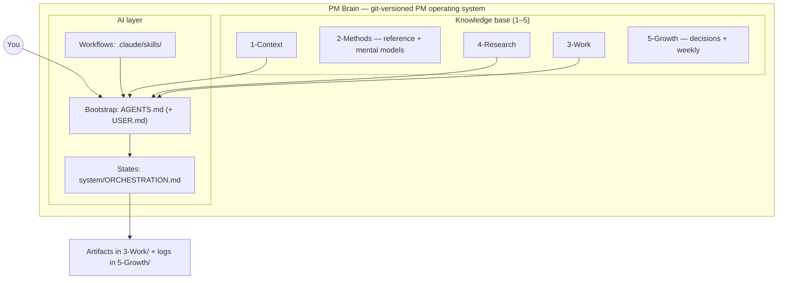
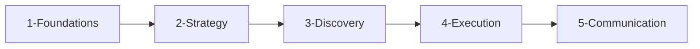

# PM Brain → Architecture Overview

**What this file is:** Maintainer deep dive — structure, loading, evals, linking conventions. **Not executed behavior** (that lives in [system/ORCHESTRATION.md](../system/ORCHESTRATION.md)). **Onboarding:** start with [README.md](../README.md) and [docs/setup.md](setup.md); this file adds detail you do not need on day one.

**Navigation:** [AGENTS.md](../AGENTS.md) (persona, wake table) · [system/ORCHESTRATION.md](../system/ORCHESTRATION.md) (states) · [2-Methods/0-index.md](../2-Methods/0-index.md) (skills + reference) · [`.claude/skills/`](../.claude/skills/) (workflows) · [system/evals/README.md](../system/evals/README.md) · [evals-fork.md](evals-fork.md) · [platform-setup.md](platform-setup.md)

**Preview:** Built-in Markdown preview may not render Mermaid. Use a Mermaid extension, GitHub, or an online editor.

---

## At a glance

```mermaid
graph TB
    subgraph repo["PM Brain — git-versioned PM operating system"]
        subgraph kb["Knowledge base (1–5)"]
            B["1-Context"]
            C["2-Methods — reference + mental models"]
            E["3-Work"]
            D["4-Research"]
            A["5-Growth — decisions + weekly"]
        end
        subgraph ai["AI layer"]
            BOOT["Bootstrap: AGENTS.md (+ USER.md)"]
            SK["Workflows: .claude/skills/"]
            ORCH["States: system/ORCHESTRATION.md"]
        end
    end
    PM(("You")) --> BOOT
    SK --> BOOT
    B --> BOOT
    D --> BOOT
    E --> BOOT
    BOOT --> ORCH
    ORCH --> OUT["Artifacts in 3-Work/ + logs in 5-Growth/"]
```

**Session flow (simplified):** message → infer state ([ORCHESTRATION](../system/ORCHESTRATION.md)) → **product_sense** (coaching) or **execution_mode** (skill + preflight) or **conversation** / **meta_reflection**. Full diagram: [system/coaching/README.md](../system/coaching/README.md).

---

## Design principles (maintainers)

User-facing summary: [principles.md](principles.md).

### Root file policy

- **Root:** `AGENTS.md` (cross-platform persona + wake table), `USER.md` (personal context), `README.md`. No duplicate human docs at root — use `docs/`.
- **Agent infrastructure:** `system/` (orchestration, coaching, evals, `EVALUATION.md`).
- **Workflows:** `.claude/skills/` (and `.claude/agents/` for delegation). Cursor/Claude Code/Copilot discover these paths natively — see [platform-setup.md](platform-setup.md).
- **Do not** add JSON manifests of the filesystem; git is the manifest.

### Bootstrap and loading

| What | Where | When loaded |
|------|--------|-------------|
| Persona, voice, lenses, principles, wake table | [AGENTS.md](../AGENTS.md) | Every conversation (native on Cursor, Claude Code 2.1.277+, Copilot) |
| Personal context | [USER.md](../USER.md) | First response if present |
| State routing, cross-cutting detail | [system/ORCHESTRATION.md](../system/ORCHESTRATION.md) | State entry / ambiguous routing |
| Braindump loop | [system/coaching/](../system/coaching/README.md) | product_sense |
| Doc / workflow requests | Matching [`.claude/skills/*/SKILL.md`](../.claude/skills/) | execution_mode (index: [2-Methods/0-index.md](../2-Methods/0-index.md)) |
| Company, initiative, research | Paths in AGENTS.md wake table | On trigger only — minimal footprint |

**Platform wiring** (one content set, different entry mechanisms): [platform-setup.md](platform-setup.md).

### Structural "do nots"

- Do not merge large on-demand files into AGENTS.md (context cost every turn).
- Do not move `AGENTS.md` out of root (platform convention).
- Do not duplicate framework templates under `2-Methods/` when a skill already owns the workflow — skills are canonical for execution; `2-Methods/` stays reference.

### Naming conventions

- **docs/:** lowercase hyphenated (`setup.md`, `architecture.md`).
- **2-Methods:** `N-name-with-hyphens.md`; domain READMEs at each level.
- **1-Context:** `CONTEXT-HEALTH.md`; content `N-company-*.md`; avatars under `1.1-Stakeholder-Avatars/`.
- **3-Work:** lowercase initiative files (`prd.md`, `decisions.md`, …).
- **5-Growth:** `decisions.md`, `weekly/` (lean practice loop).

---

## Repo layers (1–5)

| # | Folder | Purpose |
|---|--------|---------|
| **1** | **1-Context** | Company direction, stakeholders, org survival — customize |
| **2** | **2-Methods** | Mental models, bias, long-form guides — **reference**; workflows → skills |
| **3** | **3-Work** | One folder per initiative |
| **4** | **4-Research** | Evidence; link from initiatives |
| **5** | **5-Growth** | [decisions.md](../5-Growth/decisions.md) + [weekly/](../5-Growth/weekly/README.md) — calibration, not homework templates |

```mermaid
flowchart LR
  F1["1-Foundations"]
  F2["2-Strategy"]
  F3["3-Discovery"]
  F4["4-Execution"]
  F5["5-Communication"]
  F1 --> F2 --> F3 --> F4 --> F5
```

Inside `2-Methods/`, domains still run Foundations → Strategy → Discovery → Execution → Communication. **Execution paths** for PRDs, OKRs, roadmaps, etc. are skill-driven; use [0-index.md](../2-Methods/0-index.md) to pick a skill.

---

## Agent modes

Four modes: **product_sense**, **execution_mode**, **meta_reflection**, **conversation**. Defined in [ORCHESTRATION](../system/ORCHESTRATION.md).

- **product_sense:** [coaching/README](../system/coaching/README.md) until [braindump sufficiency](../system/coaching/braindump.md) (four criteria in AGENTS.md).
- **execution_mode:** load skill from `.claude/skills/`; preflight on non-trivial docs; [EVALUATION.md](../system/EVALUATION.md) before calling an artifact done.
- **meta_reflection:** offer logging in [5-Growth/](../5-Growth/README.md); decisions with confidence → [decisions.md](../5-Growth/decisions.md).
- **Eval harness** is not a conversation mode — see below.

**Cross-cutting (any state):** forecast/decision logging offer, contradiction check against [decisions.md](../5-Growth/decisions.md) and initiative `decisions.md`, evidence-strength naming, CONTEXT-HEALTH guard — [ORCHESTRATION](../system/ORCHESTRATION.md).

**Delegation:** subagents in [`.claude/agents/`](../.claude/agents/) (`context-scout`, `artifact-reviewer`, `stakeholder-simulator`); coaching stays in the main thread per [AGENTS.md](../AGENTS.md).

---

## Evaluation system

Two names — do not conflate:

| Name | Meaning | Entry |
|------|---------|--------|
| **Artifact QQC** | Quick quality checks while drafting | [system/EVALUATION.md](../system/EVALUATION.md) |
| **Harness L0–L4** | Repo health, rubric regression, behavior scenarios, human review, write hooks | [system/evals/README.md](../system/evals/README.md) |

Maintainers: CI and fork policy → [evals-fork.md](evals-fork.md). After edits to `AGENTS.md` or skills, run live L2 scenarios when the Cursor CLI is available ([platform-setup.md](platform-setup.md#live-evals-optional)).

---

## Entry points (quick reference)

| I want to… | Go to |
|------------|--------|
| Think through a decision | [system/coaching/README.md](../system/coaching/README.md) |
| Run a workflow (PRD, OKR, prioritize, …) | [2-Methods/0-index.md](../2-Methods/0-index.md) → `.claude/skills/` |
| Configure platforms | [platform-setup.md](platform-setup.md) |
| Run or extend evals | [system/evals/README.md](../system/evals/README.md) |
| First-time setup | [setup.md](setup.md) |

---

## Linking conventions

- **Cross-domain:** link to domain `README.md` (stable entry).
- **Within domain:** sibling `N-*.md` files or `../README.md`.
- **Deep links:** only when a specific framework is the point; otherwise prefer indices.
- **"For Agents" blocks:** top of `1-*-framework.md` when present; else top of folder `README.md`.
- **Numbering:** `N-Name` under content folders; no legacy `0.1-` decimals.

---

## Context health

- **Conversation rot:** ~25–30 heavy turns → capture state in `3-Work/` or `5-Growth/`, fresh chat — [ORCHESTRATION](../system/ORCHESTRATION.md).
- **Content rot:** [CONTEXT-HEALTH.md](../1-Context/CONTEXT-HEALTH.md) before trusting company docs in big artifacts.

---

## Version management

Git history is the changelog. [principles.md](principles.md) — golden record, minimal footprint.
